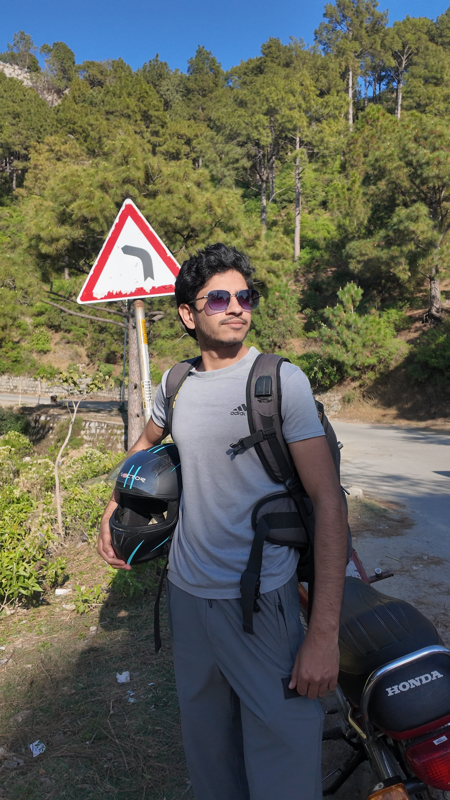
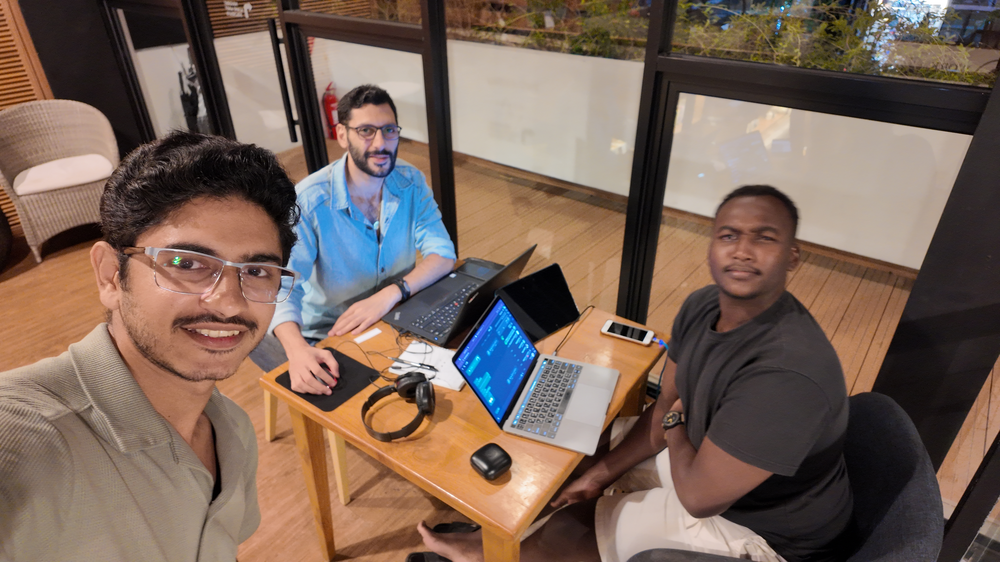
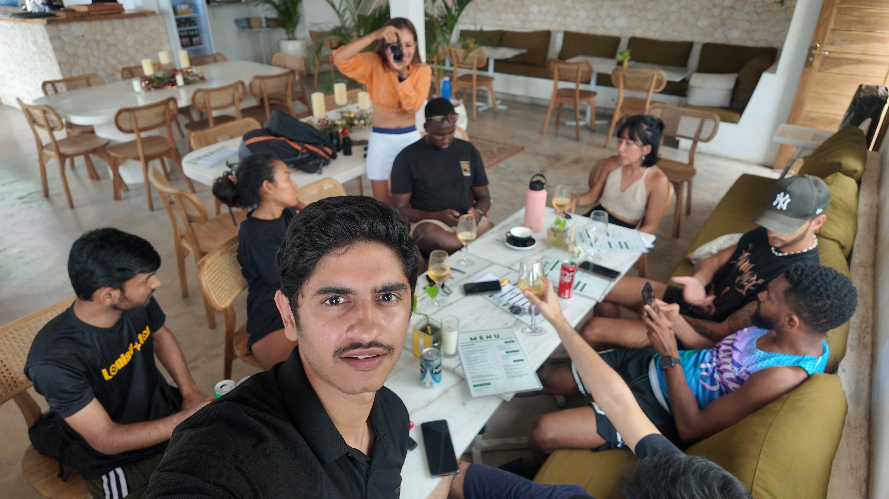
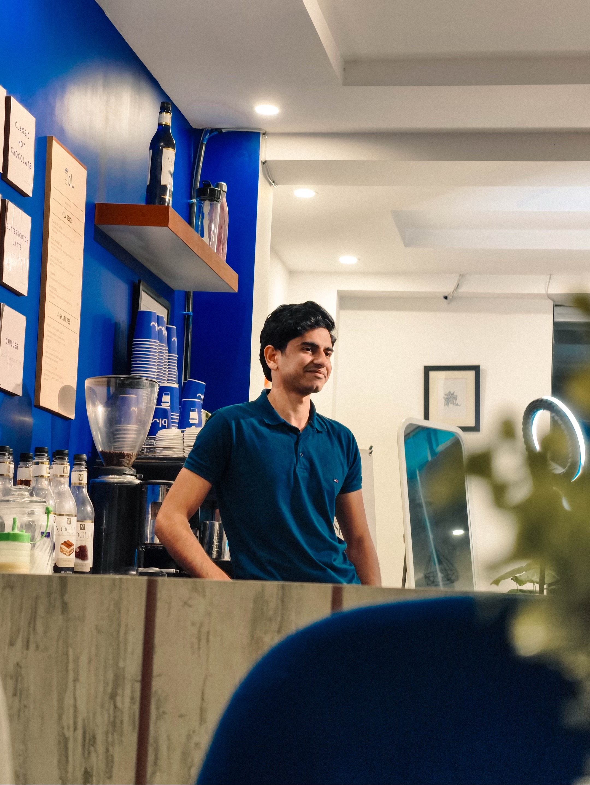

<!--
═══════════════════════════════════════════════════════════════════════════════
 Waseem Nasir — Founder, SkynetLabs · AI Automation Agency & Builder
 Hire for: Voice AI agents (ElevenLabs · Twilio · n8n) · AI chatbots (WA / IG /
            Web / Telegram) · n8n workflows · GoHighLevel · AEO content engines
            · Conversion-focused Next.js + WordPress sites · SaaS MVPs · AI
            video pipelines · Meta Pixel / CAPI
 Industries: Healthcare · Telehealth · Legal Tech · Real Estate · Automotive
             · E-Commerce · Fashion · Logistics · Maritime · HVAC · Wellness
             · Beauty · Recovery · SaaS · Consulting · Hospitality
 Stack: React · Next.js 15/16 · TypeScript · Python · n8n · WordPress · Tailwind
        Vercel · Supabase · Stripe · GoHighLevel · ElevenLabs · Twilio · OpenAI
        · Anthropic · Gemini · Apify · Meta Graph API
 Keywords: voice AI agent developer, ElevenLabs ConvAI builder, n8n developer
           for hire, GoHighLevel expert, Claude Code skill builder, AI agent
           developer, WhatsApp AI bot, AEO content engine, WordPress theme
           developer, Meta Pixel specialist, AI automation agency
═══════════════════════════════════════════════════════════════════════════════
-->

<table>
<tr>
<td width="38%" align="center">
  
   <i>Bali · May 2026 · Build week active</i>
</td>
<td width="62%" valign="top">

### I ship voice AI, automation, and sites that convert. In production. This week.

Founder of **[SkynetLabs](https://www.skynetjoe.com)** — an AI automation agency. I also build under my own name at **[waseemnasir.com](https://www.waseemnasir.com)** for clients who want a builder, not a brand.

**Latest:** Live voice AI debt-collection agent for a French real-estate group (ElevenLabs ConvAI + Twilio + Gemini + n8n orchestration). Client-validated in three test calls. Same week: car dealer demo, healthcare workflow build, three premium men's-brand landing variants, recovery-center hybrid site.

Every project below is **live, deployed, and client-approved.** I design, code, automate, deploy — usually in the same week. You talk to the person writing the code.

**Q2 2026:** 1 retainer engagement still open. Voice AI pilots scheduling.

&nbsp;

&nbsp;

</td>
</tr>
</table>

<table>
<tr>
<td align="center"><b>75+</b> Live Sites Shipped</td>
<td align="center"><b>50+</b> n8n Workflows</td>
<td align="center"><b>1</b> Voice AI Agent Live</td>
<td align="center"><b>47</b> Free Tools</td>
<td align="center"><b>14</b> Industries</td>
<td align="center"><b>10</b> Countries Served</td>
<td align="center"><b>67</b> Public Repos</td>
</tr>
</table>

---

## This Month — May 2026 Ships

> Live work from the last fortnight. Click any tile — every link is a deployed, working build.

<table>
<tr>
<td width="50%">

###  Voice AI Debt-Collection Agent
**KODIASIMMO · France · Real-estate group**

ElevenLabs ConvAI + Twilio (US DID) + Gemini 2.5 Flash + n8n orchestration. Nina FR voice @ 0.85 speed, 50s cap, 4 dynamic variables (company, debtor, amount, due date). Client-validated across three live test calls. Phase 2 orchestration in build.

`ElevenLabs ConvAI` `Twilio` `Gemini 2.5 Flash` `n8n` `French market`

</td>
<td width="50%">

###  Dads On Tour — Positive News Engine
**Fiverr · $250 custom · IG content engine pitch**

11-page pitch PDF shipped — n8n + OpenAI + Meta Graph + Telegram approval. 8 feeds, hybrid scrape + AI image rec, 2 posts/day cadence, $197/mo retainer upsell. Light cream + emerald + gold + coral palette.

`n8n` `OpenAI` `Meta Graph API` `Telegram approval`

</td>
</tr>
<tr>
<td width="50%">

###  [Kitts Recovery Services](https://kittsrecoveryservices.com/latest-landing-page)
**US recovery center — hybrid embedded site**

Full hybrid HTML embedded on Google Sites via DNS-routed domain. Anchor nav, hot-linked portrait, SkynetLabs footer credit. Baseline snapshot saved for safe revert.

`Google Sites + HTML hybrid` `DNS routing` `Anchor nav`

[**Live →**](https://kittsrecoveryservices.com/latest-landing-page)

</td>
<td width="50%">

###  [Healthcare Workflow Demo](https://healthcare-workflow-demo.vercel.app)
**Physician-group ops consultant — spec build**

13 sections, right sidebar scroll-spy, HIPAA-aware architecture, sample operator dashboard, JSON-LD schema, 14 backlinks. Free-audit CTA.

`Next.js` `TypeScript` `HIPAA-aware` `Scroll-spy nav`

[**Live →**](https://healthcare-workflow-demo.vercel.app)

</td>
</tr>
<tr>
<td width="50%">

###  [Car Dealer Demo](https://car-dealer-demo-2026-05-12.vercel.app)
**Editorial dark + gold dealer site**

Next.js 15 + React 19 + Tailwind v4. WhatsApp deep-link per car with VIN pre-fill. Mock `/admin`. Upwork $850 / Fiverr $497.

`Next.js 15` `React 19` `Tailwind v4` `WhatsApp deep-link`

[**Live →**](https://car-dealer-demo-2026-05-12.vercel.app)

</td>
<td width="50%">

###  Cite Roselyne — Email Automation
**Takycorp · France · Phase 1 ready**

n8n workflow, 17/17 validation checks pass, 30-email test set, real mailbox integration. Phase 2 retainer pitch $500/mo wired with seven deliverables.

`n8n` `IMAP/SMTP` `Email parsing` `French market`

</td>
</tr>
<tr>
<td width="50%">

###  [Automation PDF Pack — 20 Workflows](https://github.com/waseemnasir2k26/skynet-automation-pack)
**Lead magnet — 20 PDFs + n8n + carousels**

20 production-grade n8n workflows, 20 carousel HTML sets, 60-keyword ManyChat spec, GHL CSV M-F drip schedule. Public repo live.

`n8n` `ManyChat` `GHL` `Lead-magnet automation`

[**Repo →**](https://github.com/waseemnasir2k26/skynet-automation-pack)

</td>
<td width="50%">

###  MD Fashionwear — Scandi DTC
**Retainer locked — $1,100/mo · Shopify + Meta Ads**

26-page Week 1 operating plan PDF shipped. Givens locked: Shopify access, Meta BM, ZQ dropship Month 1, Scandi 4 (SE/NO/DK/FI). 9-risk matrix, RACI, walk triggers. Kickoff Mon May 18.

`Shopify` `Meta Ads` `Klaviyo` `Scandi DTC`

</td>
</tr>
</table>

---

## Building Right Now

> Status board — updated every Friday.

| Project | Client | Stack | Stage |
|---|---|---|---|
| **Voice AI Phase 2** | KODIASIMMO · FR | ElevenLabs · Twilio · n8n · Gemini | Phase 1 validated · orchestration build |
| **[citelift.app](https://citelift.app)** | Internal SaaS | Next.js · Stripe · 5-API stack | Domain verified · MVP build queued |
| **MD Fashionwear retainer** | Scandi DTC fashion | Shopify · Meta Ads · Klaviyo · GA4 | Kickoff May 18 · $1,100/mo locked |
| **Cite Roselyne Phase 2** | Takycorp · FR | n8n · email parsing · CRM sync | Demo May 15 · $500/mo retainer pitch ready |
| **Meta Ads 14-day Sprint** | Freight Command Center | Meta Ads · GHL · funnel tracking | Launch May 19 · $200 / 14d test→scale→harvest |
| **5 Flagship Bespoke Demos** | SkynetLabs portfolio | Real estate · beauty · law · restaurant · venue | Realestate first · CEO pivot $500K ARR target |
| **Bali Gulf Premium Guide** | KSA / UAE / Kuwait | Playwright PDF · Arabic webapp | ~25% built · 6 research files + 11 location cards |
| **AEO Content Engine v7** | Internal · agency use | n8n · GPT-4o-mini · Gemini | Running weekly · ~$0.30 / run |

---

## Voice AI Agents — New Vertical

> The defining capability of the next decade is software that talks back. I build it.

<table>
<tr>
<td width="38%" align="center" valign="top">
  
   <i>Voice AI is the unfair edge.</i>
</td>
<td width="62%" valign="top">

**Live agent: French debt-collection — KODIASIMMO**
- ElevenLabs ConvAI agent (Nina FR voice, 0.85 speed, 50s cap)
- Twilio US DID inbound/outbound
- Gemini 2.5 Flash brain — instruction-following + tool use
- Four dynamic variables per call (company, debtor name, amount, due date)
- n8n orchestration layer for record pull, call dispatch, transcript log
- Client-validated across three live test calls before sign-off

**Pricing tiers**
- **Pilot:** €1,997 — single use-case agent, 75 min/mo, 1 voice
- **Production:** €4,997 setup + €597/mo — multi-flow, CRM sync, transcript dashboards
- **Enterprise:** €9,997 setup + €1,497/mo — multi-agent, multi-language, white-label

**Use cases I'm taking pilots on**
- Debt collection · appointment reminders · lead qualification
- Healthcare intake · clinic triage · post-discharge follow-up
- Real estate viewing scheduler · tenant rent reminders
- Restaurant reservation assistant · clinic no-show recovery

</td>
</tr>
</table>

---

## AI Products & Automation Tools

<table>
<tr>
<td width="50%">

### [citelift.app](https://citelift.app) — Brand Citation Monitor
**LLM mention tracking SaaS · Building now**

Tracks brand mentions across Claude · ChatGPT · Perplexity · Gemini for configurable keyword sets. Daily cron pulls write to sqlite. Weekly markdown report shows mention counts, citation position, deltas. Domain verified, MVP scoped. Free + Pro tier.

`Next.js` `Stripe` `SQLite → Supabase` `5-API stack`

</td>
<td width="50%">

### [AEO Content Engine v7.0](https://github.com/waseemnasir2k26/aeo-content-engine)
**Two-model AEO content pipeline · ~$0.30 per run**

GPT-4o-mini + Gemini 2.5 Flash. Daily (11 nodes) + Weekly (51 nodes) workflows. Gemini header auth, 3-retry error handling across 19 nodes. Free keyword research, 52-week dedup, branded email delivery.

`n8n` `GPT-4o-mini` `Gemini 2.5 Flash` `AEO` `~60% cost-cut`

</td>
</tr>
<tr>
<td width="50%">

### [Skynet Labs Toolkit](https://skynetlabs-toolkit.vercel.app) — 47 Free Agency Tools
**Live with Supabase analytics**

AI ROI Calculator · Rate Calculator · Proposal Builder · Content Calendar · Scope Tracker · Testimonial Collector · Project Tracker · AI Readiness Quiz · Client Onboarding · NDA System.

`React` `Vite` `Supabase` `Vercel`

[**Live →**](https://skynetlabs-toolkit.vercel.app)

</td>
<td width="50%">

### [AI Video Editor](https://github.com/waseemnasir2k26/ai-video-editor)
**Multi-version video pipeline · Batch-render at volume**

Claude Code + FFmpeg + Python + pycaps. Captions, BGM, transitions, multi-version reels. Built for content agencies running at volume.

`Python` `FFmpeg` `Claude Code` `pycaps`

</td>
</tr>
<tr>
<td width="50%">

### [Fiverr Gig Optimizer](https://github.com/waseemnasir2k26/fiverr-gig-optimizer)
**Claude Code skill · Full catalog in 15 minutes**

Generates research-backed titles, descriptions, tags, pricing, thumbnails, cross-sell funnels. Production-tested on my own 23-gig catalog.

`Claude Code` `Python` `AI Strategy`

</td>
<td width="50%">

### [FB → IG Clone Engine](https://github.com/waseemnasir2k26)
**Bundle ready · Apify + n8n + gpt-image-1**

Scrape Facebook page → Claude rewrite → gpt-image-1 redesign with founder portrait → repost FB + IG. ~$35/mo runtime cost. Eight-file bundle.

`Apify` `n8n` `Supabase` `gpt-image-1` `Meta Graph API`

</td>
</tr>
</table>

---

## Services — Three Tiers

> Direct-hire, retainer, or full agency engagement. No account managers. You message me, I ship.

### Flagship Builds — $5K – $15K bespoke

> 1-of-1 premium showcase sites that look like they cost $50K+. Five flagships in build queue: realestate · beauty · restaurant · law · event venue.

| Tier | What You Get | Timeline |
|---|---|---|
| **Flagship Site** | Bespoke design, no template DNA, 12–20 sections, R3F or GSAP hero, JSON-LD schema, SEO/AEO base, Vercel deploy, GitHub repo, 90-day support | 3–4 weeks |
| **Flagship + Funnel** | Above + Tally/HubSpot quiz funnel, lead-scoring, 5-email nurture, Meta Pixel + CAPI, video Loom kickoff | 4–6 weeks |
| **Flagship + SaaS MVP** | Above + multi-tenant SaaS layer (Supabase auth, Stripe, dashboard) | 6–8 weeks |

### Voice AI & Automation — Productized retainers

| Service | What You Get | Starts At |
|---|---|---|
| **Voice AI Pilot** | ElevenLabs agent + Twilio number + 75 min/mo + single use-case + Loom training | €1,997 |
| **Voice AI Production** | Multi-flow agent + CRM sync + transcript dashboards + monthly tuning | €4,997 + €597/mo |
| **n8n Automation Workflows** | Custom AI chains (GPT/Claude/Gemini), webhooks, CRM sync | $250 |
| **AI Chatbots — WA / IG / Web / Telegram** | Multi-channel, memory, human handoff, lead qualification | $400 |
| **AEO Content Engines** | n8n + dual-model pipeline, weekly AEO articles on autopilot | $2,000 |
| **GoHighLevel Setup & Automation** | Snapshots, funnels, pipelines, CSV scheduling, SMS/email | $500 |
| **Claude Code Skills & MCP Servers** | Custom skills, agent design, MCP wiring, internal ops automation | $750 |

### Standard Sites & Systems

| Service | What You Get | Starts At |
|---|---|---|
| **Conversion-Focused Site** | Next.js or WordPress, Tailwind, deploy, SEO base, 3 design variants | $1,200 |
| **WordPress Theme + Companion Plugin** | Custom theme, plugin, headless option, premium funnel build | $800 |
| **SaaS MVP** | Next.js + FastAPI + Supabase, auth, Stripe, multi-tenant, deployed | $3,500 |
| **AI Video Pipeline** | Remotion + pycaps + FFmpeg batch render, captions, BGM, transitions | $1,200 |
| **Meta Pixel + CAPI Setup** | Server-side tracking, iOS 17+ safe, deduplication, full audit | $350 |
| **Automation Audit** | 5-day audit + 90-day roadmap. Workflow map, ROI model, buy-vs-build | $1,500 |

&nbsp;

&nbsp;

---

## Full Portfolio — 75+ Live Projects by Industry

> Every link is a **deployed, working build.** Not tutorials. Real client projects.

<b>Voice AI & Conversational Agents (1 live · pilots open)</b>

 

| Project | Stack | Status |
|---------|-------|--------|
| KODIASIMMO Voice Debt-Collection — FR real-estate group | ElevenLabs ConvAI · Twilio · Gemini · n8n | **Live · Phase 2 in build** |
| Healthcare intake agent · pilot slot open | ElevenLabs · Twilio · n8n | Open for pilot |
| Real-estate viewing scheduler · pilot slot open | ElevenLabs · GHL · Twilio | Open for pilot |
| Restaurant reservation assistant · pilot slot open | ElevenLabs · Toast/Square API | Open for pilot |

<b>Healthcare & Medical (7 projects)</b>

 

| Project | Stack | Live Demo |
|---------|-------|-----------|
| [Healthcare Workflow Demo](https://healthcare-workflow-demo.vercel.app) — Physician-group ops consultant, HIPAA-aware | Next.js · TypeScript · JSON-LD | [Live →](https://healthcare-workflow-demo.vercel.app) |
| [SkynetLabs Clinic UK](https://github.com/waseemnasir2k26/skynetlabs-clinic) — Clinical Lead Nurse consultancy, CQC compliance | Next.js 16 · R3F · TypeScript | — |
| [Hepatologia Course](https://hepatologia-course.vercel.app) — Bilingual medical course platform, Peru | HTML/CSS/JS · WordPress-ready | [Live →](https://hepatologia-course.vercel.app) |
| [Axis RX Funnel](https://axis-rx-funnel.vercel.app) — GLP-1 medical funnel, 3 landing variants | React · TypeScript · Tailwind | [Live →](https://axis-rx-funnel.vercel.app) |
| [VitalPath Telehealth](https://glp2-telehealth.vercel.app) — GLP-2 telehealth platform | Next.js 14 · TypeScript | [Live →](https://glp2-telehealth.vercel.app) |
| [Healthcare Landing](https://healthcare-landing-murex.vercel.app) — Bilingual digital health platform | React · Tailwind | [Live →](https://healthcare-landing-murex.vercel.app) |
| [CaringHands Homecare](https://caringhands-homecare.vercel.app) — Elder care services | React · Tailwind | [Live →](https://caringhands-homecare.vercel.app) |

<b>Recovery, Wellness & Beauty (4 projects)</b>

 

| Project | Stack | Live Demo |
|---------|-------|-----------|
| [Kitts Recovery Services](https://kittsrecoveryservices.com/latest-landing-page) — Hybrid embedded recovery center | Google Sites hybrid · HTML · DNS routing | [Live →](https://kittsrecoveryservices.com/latest-landing-page) |
| Wellness DNA — Pre-launch DNA-driven wellness | Next.js · 5-variant demo | Pitched · cold |
| Ariapura Wellness — Italian relaunch, 5 variants | Next.js · Italian market | Pitched · cold |
| Aesthetic Clinic LP — DSGVO + HWG German clinics | Next.js · DE compliance | Pitched · cold |

<b>Automotive (1 project)</b>

 

| Project | Stack | Live Demo |
|---------|-------|-----------|
| [Car Dealer Demo](https://car-dealer-demo-2026-05-12.vercel.app) — Editorial dark+gold, WhatsApp VIN deep-link, mock admin | Next.js 15 · React 19 · Tailwind v4 | [Live →](https://car-dealer-demo-2026-05-12.vercel.app) |

<b>Fashion, Lifestyle & DTC (1 active retainer)</b>

 

| Project | Stack | Status |
|---------|-------|--------|
| MD Fashionwear — Scandi DTC retainer, $1,100/mo, SE/NO/DK/FI launch | Shopify · Meta Ads · Klaviyo · GA4 | Kickoff May 18 |

<b>Logistics & Maritime (3 projects)</b>

 

| Project | Stack | Live Demo |
|---------|-------|-----------|
| [FreightCommand](https://load-broker-portal.vercel.app) — Load broker SaaS with bidding & tracking | React 19 · Vite · Tailwind | [Live →](https://load-broker-portal.vercel.app) |
| [Limenis Global Advisory](https://limenis-website.vercel.app) — Maritime & port consulting | Next.js · TypeScript | [Live →](https://limenis-website.vercel.app) |
| [What's The Move](https://whats-the-move-nine.vercel.app) — Labor-only moving, Charleston SC | React · Vite · Tailwind | [Live →](https://whats-the-move-nine.vercel.app) |

<b>Consulting & Agency (4 projects)</b>

 

| Project | Stack | Live Demo |
|---------|-------|-----------|
| [CPG Synergy](https://cpg-synergy-redesign.vercel.app) — CPG agency, 5 design variants | React · Framer Motion | [Live →](https://cpg-synergy-redesign.vercel.app) |
| [Ascend Consulting](https://consulting-firm-phi.vercel.app) — Consulting firm, 3 variants | React · Framer Motion | [Live →](https://consulting-firm-phi.vercel.app) |
| [Ferrante Media](https://ferrante-media-premium.vercel.app) — AI automation agency | React · TypeScript | [Live →](https://ferrante-media-premium.vercel.app) |
| [SOOR Technologies](https://soor-technologies.vercel.app) — Odoo ERP partner, Kuwait | React · Vite | [Live →](https://soor-technologies.vercel.app) |

<b>E-Commerce & Food (3 projects)</b>

 

| Project | Stack | Live Demo |
|---------|-------|-----------|
| [Recipe Website](https://recipe-website-sand-theta.vercel.app) — Digital recipe e-commerce + subscriptions | React · Vite · Tailwind | [Live →](https://recipe-website-sand-theta.vercel.app) |
| [LUXE Store](https://ecommerce-website-gray-gamma.vercel.app) — Premium online store | React · Vite · Tailwind | [Live →](https://ecommerce-website-gray-gamma.vercel.app) |
| [Usama Bakery](https://usama-bakery-website.vercel.app) — Local bakery with amber glow design | React · Tailwind | [Live →](https://usama-bakery-website.vercel.app) |

<b>Real Estate & Home Services (5 projects)</b>

 

| Project | Stack | Live Demo |
|---------|-------|-----------|
| [MN Realty Co](https://mn-realty-co.vercel.app) — Real estate listings platform | Next.js · TypeScript · Framer Motion | [Live →](https://mn-realty-co.vercel.app) |
| [Pretty Potty NYC](https://pretty-potty.vercel.app) — Luxury mobile restrooms, Long Island | React · Vite · Framer Motion | [Live →](https://pretty-potty.vercel.app) |
| [Main Clim](https://mainclim-website.vercel.app) — HVAC services, Benin | Next.js 14 · TypeScript | [Live →](https://mainclim-website.vercel.app) |
| [Next Level Retreat Designs](https://github.com/waseemnasir2k26/next-level-retreat-designs) — Corey Boutwell men's retreat, 6 variants | React · Vite · Framer Motion | — |
| [KSA Shoes Store](https://ksa-shoes-store-five.vercel.app) — Al-Zaytoun luxury footwear | Next.js 16 · TypeScript · Tailwind | [Live →](https://ksa-shoes-store-five.vercel.app) |

<b>Legal & Education (3 projects)</b>

 

| Project | Stack | Live Demo |
|---------|-------|-----------|
| [JudgeAI](https://judgeai-eta.vercel.app) — AI legal analysis platform | Next.js · TypeScript · OpenAI | [Live →](https://judgeai-eta.vercel.app) |
| [Doctorate Portfolio](https://doctorate-portfolio.vercel.app) — Academic/PhD portfolio template | React · Tailwind | [Live →](https://doctorate-portfolio.vercel.app) |
| [Dominique McClaney](https://dominique-mcclaney-portfolio.vercel.app) — Full-stack engineer portfolio | React · Vite | [Live →](https://dominique-mcclaney-portfolio.vercel.app) |

<b>Events, Hospitality & Travel (3 projects)</b>

 

| Project | Stack | Live Demo |
|---------|-------|-----------|
| [Iron Fist Wrestling](https://github.com/waseemnasir2k26/wrestling-event-landing) — Night of Champions event landing | React · Vite · Tailwind | — |
| Bali Gulf Premium Guide — Arabic PDF+webapp for KSA/UAE/Kuwait | Playwright · Arabic UX · 29LT fonts | ~25% built |
| Salon Suite Rental — Atelier Suites, 3 variants | Next.js · Stripe deposit | Pitched · cold |

<b>WordPress Themes & Plugins (4 projects)</b>

 

| Project | Stack | Notes |
|---------|-------|-------|
| [waseemnasir.com Theme v3.8](https://github.com/waseemnasir2k26/waseemnasir-theme) — Personal brand theme + companion plugin v1.2.0 | WordPress · PHP · Tailwind | Live |
| [What's The Move Theme](https://github.com/waseemnasir2k26/whats-the-move-theme) — Labor-only moving, Charleston SC | WordPress · PHP · Tailwind | Live |
| [SkynetLabs WordPress Theme](https://github.com/waseemnasir2k26/skynetlabs-wordpress-theme) — Agency theme | WordPress · PHP | Live |
| [Idea Viaggi / INPSIEME plugins](https://github.com/waseemnasir2k26) — Italian tour operator, customer trip manager v2.5.1 + login bulldozer v1.2.2 | WordPress · PHP · JS | Live · regular client |

<b>AI, Automation & SaaS Tools (12 projects)</b>

 

| Project | Stack | Status |
|---------|-------|--------|
| [citelift.app](https://citelift.app) — Brand citation monitor across 4 LLMs | Next.js · 5-API · sqlite | MVP build queued |
| [Automation PDF Pack](https://github.com/waseemnasir2k26/skynet-automation-pack) — 20 PDFs + 20 n8n + 60 ManyChat keywords | n8n · ManyChat · GHL | Live |
| [AEO Content Engine](https://github.com/waseemnasir2k26/aeo-content-engine) — GPT-4o-mini + Gemini content pipeline | n8n · GPT-4o-mini · Gemini | Live |
| [AI Video Editor](https://github.com/waseemnasir2k26/ai-video-editor) — Multi-version video pipeline | Python · FFmpeg · pycaps | Live |
| [Fiverr Gig Optimizer](https://github.com/waseemnasir2k26/fiverr-gig-optimizer) — AI gig strategy generator | Claude Code · Python | Live |
| [Skynet Labs Toolkit](https://skynetlabs-toolkit.vercel.app) — 47 free tools for agencies | React · Supabase | [Live →](https://skynetlabs-toolkit.vercel.app) |
| [Contact Extractor](https://contact-extractor-black.vercel.app) — Extract emails/phones from any site | Python · Vercel | [Live →](https://contact-extractor-black.vercel.app) |
| [Social Media Dashboard](https://social-media-dashboard-five-zeta.vercel.app) — Multi-platform posting with OAuth | React · Python | [Live →](https://social-media-dashboard-five-zeta.vercel.app) |
| [FreelanceFlow AI](https://github.com/waseemnasir2k26/freelanceflow-ai-extension) — Chrome extension for freelancers | JavaScript · Ollama · OpenAI | Live |
| [VEO3 Scene Generator](https://veo3-scene-generator.vercel.app) — AI video scene tool | TypeScript · React | [Live →](https://veo3-scene-generator.vercel.app) |
| [3D Scroll Hero](https://scroll-hero-kohl.vercel.app) — Adaline.ai-style scroll animation | Next.js · GSAP · Three.js | [Live →](https://scroll-hero-kohl.vercel.app) |
| [SkynetLabs Carousels Batch 5](https://github.com/waseemnasir2k26/skynetlabs-carousels-batch5) — Multi-platform carousels | Python · Pillow · GHL CSV | Live |

---

## Tech Stack

**Frontend** &nbsp;&nbsp;        

**Voice & AI** &nbsp;&nbsp;      

**Automation** &nbsp;&nbsp;      

**Platforms & Infra** &nbsp;&nbsp;       

---

## GitHub Stats

  
  

  

  

---

## Why I Build

<table>
<tr>
<td width="35%" align="center">
  
   <i>Build mode. 2AM. Watch on. Bali rain outside.</i>
</td>
<td width="65%" valign="top">

I grew up in Pakistan watching my family grind for every rupee. I learned two things early: **leverage matters**, and **software is the cheapest leverage on Earth.**

SkynetLabs exists for one reason — deliver agency-grade builds with freelancer-grade speed. No 8-week kickoffs. No 12-person approval chains. You tell me what you want, I ship a working version, you tell me what's wrong, I fix it. Done in weeks, not quarters.

Every repo here is a real project for a real person. No toy demos, no tutorial clones. When you hire me, you get the same velocity you see on this page.

**My 2026 thesis:** Voice AI agents and conversion-first sites win the next two years. I'm shipping into that wave every week.

**If that's the energy you want on your next build — let's talk.**

</td>
</tr>
</table>

---

## Life Beyond the Keyboard

> Code pays the bills. These rooms, roads, and rituals keep the tank full.

<table>
<tr>
<td width="25%" align="center">
  
   <b>Bali</b> <i>Why I grind.</i>
</td>
<td width="25%" align="center">
  
   <b>The Road</b> <i>Motorcycle + mountains + no signal.</i>
</td>
<td width="25%" align="center">
  
   <b>The Edge</b> <i>Best ideas come at cliffsides.</i>
</td>
<td width="25%" align="center">
  
   <b>The Team</b> <i>Laptops open, coffee cold, work hot.</i>
</td>
</tr>
<tr>
<td width="25%" align="center">
  
   <b>The Table</b> <i>Network compound interest — 10 yrs in.</i>
</td>
<td width="25%" align="center">
  
   <b>The Rooftop</b> <i>Bali skyline · planning week.</i>
</td>
<td width="25%" align="center">
  
   <b>Rooms I Sneak Into</b> <i>Learning > credentials.</i>
</td>
<td width="25%" align="center">
  
   <b>The Thinking Seat</b> <i>Cafe · ship mode.</i>
</td>
</tr>
</table>

> **Currently:** Bali · digital-nomad route Lahore → Singapore → Bangkok → Malaysia → Bali. Building in public, shipping in private, answering DMs.

---

## Let's Work Together

**Building a voice AI agent, SaaS, automation pipeline, chatbot, or conversion site?** 
75+ shipped across healthcare, legal, automotive, real estate, fashion, logistics, wellness, recovery, and more.

 

 

---

  Every repo is a real project — deployed, functional, client-approved. Star what you like. <b>Q2 2026: voice AI pilots open · 1 retainer slot left.</b>

