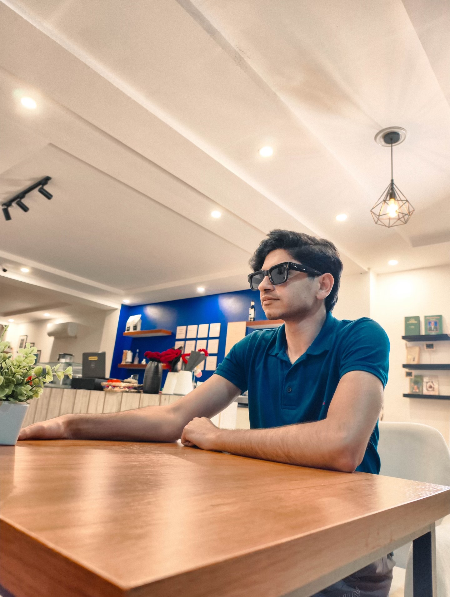

<!--
═══════════════════════════════════════════════════════════════════════════════
 Waseem Nasir — Founder, SkynetLabs · AI Automation Agency & Indie Builder
 Hire for: n8n workflows · GoHighLevel · Claude Code skills · AI chatbots
            (IG / WhatsApp / Web / Telegram) · AEO content engines · WordPress
            themes + plugins · Meta Pixel / CAPI · SaaS MVPs · AI video pipelines
 Industries: Healthcare · Telehealth · Legal Tech · Real Estate · E-Commerce
             Logistics · Maritime · HVAC · Moving · Wellness · SaaS · Consulting
 Stack: React · Next.js · TypeScript · Python · n8n · WordPress · Tailwind
        Vercel · Supabase · Stripe · GoHighLevel · OpenAI · Anthropic · Gemini
 Keywords: AI automation agency, n8n developer for hire, GoHighLevel expert,
           Claude Code skill builder, AI agent developer, WhatsApp AI bot,
           AEO content engine, WordPress theme developer, Meta Pixel specialist
═══════════════════════════════════════════════════════════════════════════════
-->

<table>
<tr>
<td width="38%" align="center">
  
   <i>Building mode · Lahore → Bali · May 2026</i>
</td>
<td width="62%" valign="top">

### Hi, I'm Waseem. I ship things that make money.

Founder of **[SkynetLabs](https://www.skynetjoe.com)** — an AI automation agency. I also build under my own name at **[waseemnasir.com](https://www.waseemnasir.com)** for clients who want to work with a human, not a logo.

I design, code, automate and deploy — usually in the same week. No account managers, no Zoom theatre. You talk to the person writing the code.

**What I actually do:**
- n8n workflows + AI agent chains (50+ in production)
- WhatsApp / Instagram / Telegram AI chatbots for service businesses
- AEO content engines that publish weekly without a human
- Next.js + WordPress sites that convert, not just look pretty
- SaaS MVPs (Next.js + FastAPI + Supabase) — idea to live in 4–6 weeks
- AI video pipelines (Remotion + pycaps + FFmpeg) at scale

**Q2 2026:** Accepting 2 retainer engagements.

&nbsp;

&nbsp;

</td>
</tr>
</table>

<table>
<tr>
<td align="center"><b>67</b> Public Repos</td>
<td align="center"><b>50+</b> Live Client Sites</td>
<td align="center"><b>50+</b> n8n Workflows</td>
<td align="center"><b>47</b> Free Tools Shipped</td>
<td align="center"><b>10+</b> Industries</td>
<td align="center"><b>7</b> Countries Served</td>
</tr>
</table>

---

## Currently Shipping (April 2026)

> Status board — what's being built right this second. Updated weekly.

| Project | Client | Stack | Stage |
|---|---|---|---|
| **[SkynetLabs Clinic UK](https://github.com/waseemnasir2k26/skynetlabs-clinic)** | Clinical Lead Nurse · UK | Next.js 16 · React Three Fiber · TS | Live · pitch sent |
| **Citè Roselyne WhatsApp Bot** | French real-estate developer | n8n · GPT · WhatsApp Cloud API | Kickoff this week |
| **[Pretty Potty NYC](https://github.com/waseemnasir2k26/pretty-potty)** | Luxury porta-potty · Long Island | React · Framer Motion | 5 variants live → V4/V5 finalization |
| **[Hepatologia Course](https://github.com/waseemnasir2k26/hepatologia-course)** | Dr. Julio Santiago Marcelo · Peru | WordPress · Mercado Pago | Corrections in progress |
| **[waseemnasir.com Theme v3.8](https://github.com/waseemnasir2k26/waseemnasir-theme)** | Personal brand | WordPress · custom plugin | v3.8.1 shipped · companion plugin v1.0.0 |
| **[Wrestling Event Landing](https://github.com/waseemnasir2k26/wrestling-event-landing)** | Fiverr spec · Iron Fist Wrestling | React · Vite | Demo shipped · awaiting reply |
| **[AEO Content Engine v7](https://github.com/waseemnasir2k26/aeo-content-engine)** | Internal · agency use | n8n · GPT-4.1 · Gemini | Running weekly · ~$0.30/run |
| **Attention OS App** | Indie product · Android | Kotlin · Compose · Play + sideload | MVP plan locked · build phase |

---

## Recent Client Work

> Every project is **live and deployed**. Click to see it in action.

<table>
<tr>
<td width="50%">

###  [SkynetLabs Clinic UK](https://github.com/waseemnasir2k26/skynetlabs-clinic)
**Clinical Lead Nurse Consultancy — UK**

CQC compliance, safeguarding, care planning. Built and deployed in a weekend. Next.js 16 + React Three Fiber cinematic 3D hero.

`Next.js 16` `TypeScript` `React Three Fiber` `Tailwind`

</td>
<td width="50%">

###  [What's The Move WP Theme](https://github.com/waseemnasir2k26/whats-the-move-theme)
**Labor-Only Moving — Charleston, SC**

Custom WordPress theme — Tailwind CSS, Customizer settings, quote form, interactive widgets. Shipped end-to-end.

`WordPress` `Tailwind` `PHP` `Custom Theme`

</td>
</tr>
<tr>
<td width="50%">

###  [Pretty Potty NYC](https://github.com/waseemnasir2k26/pretty-potty)
**Luxury Mobile Restroom Rentals — Long Island, NY**

5 landing page variants, WhatsApp booking, service area targeting, luxury glassmorphism UI with gold accents.

`React` `Vite` `Tailwind CSS` `Framer Motion`

[**Live Demo →**](https://pretty-potty.vercel.app)

</td>
<td width="50%">

###  [What's The Move](https://github.com/waseemnasir2k26/whats-the-move)
**Labor-Only Moving Company — Charleston, SC**

7-page marketing site with instant quote calculator, truck recommender AI, live chat "Charlie", service area maps.

`React 18` `Vite` `Tailwind CSS` `Framer Motion`

[**Live Demo →**](https://whats-the-move-nine.vercel.app)

</td>
</tr>
<tr>
<td width="50%">

###  [Hepatologia Course](https://github.com/waseemnasir2k26/hepatologia-course)
**Medical Education Platform — Lima, Peru**

Bilingual (Spanish) course platform for cirrhosis patients. 3 modules + 3 bonuses, student portal with Vimeo, quiz system, Mercado Pago checkout.

`HTML/CSS/JS` `WordPress-Ready` `Vimeo` `Mercado Pago`

[**Live Demo →**](https://hepatologia-course.vercel.app)

</td>
<td width="50%">

###  [Recipe Website](https://github.com/waseemnasir2k26/recipe-website)
**Digital Recipe E-Commerce — Upwork Client**

18 recipes, bundle builder, $9.99 subscription model, Stripe/PayPal checkout, admin dashboard with analytics.

`React` `Vite` `Tailwind CSS` `Stripe` `PayPal`

[**Live Demo →**](https://recipe-website-sand-theta.vercel.app)

</td>
</tr>
<tr>
<td width="50%">

###  [CPG Synergy](https://github.com/waseemnasir2k26/cpg-synergy-redesign)
**Consumer Goods Consulting Agency Redesign**

5 unique design variants with animated transitions, lead funnels, and interactive design selector for the client to choose.

`React` `Framer Motion` `Vite` `Tailwind CSS`

[**Live Demo →**](https://cpg-synergy-redesign.vercel.app)

</td>
<td width="50%">

###  [Main Clim](https://github.com/waseemnasir2k26/mainclim-website)
**HVAC & Climate Services — Benin, West Africa**

3 landing page variants, service booking, French-ready bilingual architecture, Framer Motion animations.

`Next.js 14` `TypeScript` `Tailwind CSS` `Framer Motion`

[**Live Demo →**](https://mainclim-website.vercel.app)

</td>
</tr>
</table>

---

## AI Products & Automation Tools

<table>
<tr>
<td width="50%">

### [AEO Content Engine v7.0](https://github.com/waseemnasir2k26/aeo-content-engine)
**Automated AI content pipeline for agencies**

Two-model pipeline (GPT-4.1 + Gemini 2.5 Flash). Weekly AEO-optimized articles, newsletters, video scripts. Free keyword research, 52-week dedup, branded email delivery. **~$0.30 per full run.**

`n8n` `GPT-4.1` `Gemini 2.5 Flash` `AEO` `Content Automation`

</td>
<td width="50%">

### [Skynet Labs Toolkit](https://github.com/waseemnasir2k26/skynetlabs-toolkit)
**47 free tools for freelancers & agencies**

AI ROI Calculator, Rate Calculator, Proposal Builder, Content Calendar, Scope Tracker, Testimonial Collector, Project Tracker, AI Readiness Quiz, Client Onboarding & NDA System. Live with Supabase analytics.

`React` `Vite` `Supabase` `Vercel` &nbsp; [**Live →**](https://skynetlabs-toolkit.vercel.app)

</td>
</tr>
<tr>
<td width="50%">

### [AI Video Editor](https://github.com/waseemnasir2k26/ai-video-editor)
**Multi-version video editing pipeline**

Claude Code + FFmpeg + Python + pycaps. Batch-render social media reels with captions, BGM, transitions. Built for content agencies running at volume.

`Python` `FFmpeg` `Claude Code` `pycaps`

</td>
<td width="50%">

### [Fiverr Gig Optimizer](https://github.com/waseemnasir2k26/fiverr-gig-optimizer)
**AI-powered Fiverr gig strategy generator**

Claude Code skill that generates research-backed titles, descriptions, tags, pricing, thumbnails, and cross-sell funnels. Full catalog in 15 minutes.

`Claude Code` `Python` `AI Strategy`

</td>
</tr>
</table>

---

## Services I Offer

> Available for freelance, contract, retainer, and full agency engagements via **[waseemnasir.com](https://www.waseemnasir.com)**, **Fiverr**, **Upwork**, and direct.

| Service | What You Get | Starts At |
|---|---|---|
| **n8n Automation Workflows** | Custom workflows, AI integrations, webhook orchestration, GPT/Claude/Gemini chains | $250 |
| **AI Chatbots (IG / WA / Web / Telegram)** | Multi-channel bots with memory, handoff to human, CRM sync, lead qualification | $400 |
| **AEO Content Engines** | n8n + GPT-4.1 + Gemini pipelines. Weekly AEO-optimized articles on autopilot | $2,000 |
| **WordPress Themes + Plugins** | Custom themes, companion plugins, headless WP, premium funnel builds | $800 |
| **Meta Pixel + CAPI Setup** | Server-side tracking, conversion API, iOS 17+ safe, deduplication, audit | $350 |
| **GoHighLevel Setup & Automation** | GHL snapshots, funnels, pipelines, bulk CSV scheduling, SMS/email sequences | $500 |
| **SaaS MVPs (Next.js + FastAPI + Supabase)** | Full-stack MVP, auth, Stripe, multi-tenant, deployed. 4–6 weeks idea-to-live | $3,500 |
| **AI Video Pipelines** | Remotion + pycaps + FFmpeg batch rendering. Captions, BGM, transitions at volume | $1,200 |
| **Automation Audits** | 5-day audit + 90-day roadmap. Workflow map, ROI model, buy-vs-build recs | $1,500 |
| **Claude Code Skills & MCP Servers** | Custom skills, agent design, MCP server wiring, internal ops automation | $750 |
| **Industry-Specific Websites** | Healthcare, Legal, Real Estate, E-Commerce, Logistics, HVAC, Maritime, Wellness | $1,200 |

Every project ships **fast**, every site is **deployed live**, every workflow is **production-tested**.

&nbsp;

&nbsp;

---

## Full Portfolio — 50+ Live Projects by Industry

> Every link below is a **deployed, working demo**. Not tutorials — production-grade projects.

<b>Healthcare & Medical (6 projects)</b>

 

| Project | Stack | Live Demo |
|---------|-------|-----------|
| [SkynetLabs Clinic UK](https://github.com/waseemnasir2k26/skynetlabs-clinic) — Clinical Lead Nurse consultancy, CQC compliance | Next.js 16, R3F, TypeScript | — |
| [Hepatologia Course](https://github.com/waseemnasir2k26/hepatologia-course) — Medical course platform, bilingual Spanish | HTML/CSS/JS, WordPress-ready | [Live →](https://hepatologia-course.vercel.app) |
| [Axis RX Funnel](https://github.com/waseemnasir2k26/axis-rx-funnel) — GLP-1 medical funnel, 3 landing variants | React, TypeScript, Tailwind | [Live →](https://axis-rx-funnel.vercel.app) |
| [VitalPath Telehealth](https://github.com/waseemnasir2k26/glp2-telehealth) — GLP-2 telehealth platform | Next.js 14, TypeScript | [Live →](https://glp2-telehealth.vercel.app) |
| [Healthcare Landing](https://github.com/waseemnasir2k26/healthcare-landing) — Bilingual digital health platform | React, Tailwind CSS | [Live →](https://healthcare-landing-murex.vercel.app) |
| [CaringHands Homecare](https://github.com/waseemnasir2k26/caringhands-homecare) — Elder care services | React, Tailwind CSS | [Live →](https://caringhands-homecare.vercel.app) |

<b>Logistics & Maritime (3 projects)</b>

 

| Project | Stack | Live Demo |
|---------|-------|-----------|
| [FreightCommand](https://github.com/waseemnasir2k26/load-broker-portal) — Load broker SaaS with bidding & tracking | React 19, Vite, Tailwind | [Live →](https://load-broker-portal.vercel.app) |
| [Limenis Global Advisory](https://github.com/waseemnasir2k26/limenis-website) — Maritime & port consulting | Next.js, TypeScript | [Live →](https://limenis-website.vercel.app) |
| [What's The Move](https://github.com/waseemnasir2k26/whats-the-move) — Labor-only moving, Charleston SC | React, Vite, Tailwind | [Live →](https://whats-the-move-nine.vercel.app) |

<b>Consulting & Agency (4 projects)</b>

 

| Project | Stack | Live Demo |
|---------|-------|-----------|
| [CPG Synergy](https://github.com/waseemnasir2k26/cpg-synergy-redesign) — CPG agency, 5 design variants | React, Framer Motion | [Live →](https://cpg-synergy-redesign.vercel.app) |
| [Ascend Consulting](https://github.com/waseemnasir2k26/consulting-firm) — Consulting firm, 3 variants | React, Framer Motion | [Live →](https://consulting-firm-phi.vercel.app) |
| [Ferrante Media](https://github.com/waseemnasir2k26/ferrante-media-premium) — AI automation agency | React, TypeScript | [Live →](https://ferrante-media-premium.vercel.app) |
| [SOOR Technologies](https://github.com/waseemnasir2k26/soor-technologies) — Odoo ERP partner, Kuwait | React, Vite | [Live →](https://soor-technologies.vercel.app) |

<b>E-Commerce & Food (3 projects)</b>

 

| Project | Stack | Live Demo |
|---------|-------|-----------|
| [Recipe Website](https://github.com/waseemnasir2k26/recipe-website) — Digital recipe e-commerce + subscriptions | React, Vite, Tailwind | [Live →](https://recipe-website-sand-theta.vercel.app) |
| [LUXE Store](https://github.com/waseemnasir2k26/ecommerce-website) — Premium online store | React, Vite, Tailwind | [Live →](https://ecommerce-website-gray-gamma.vercel.app) |
| [Usama Bakery](https://github.com/waseemnasir2k26/usama-bakery-website) — Local bakery with amber glow design | React, Tailwind | [Live →](https://usama-bakery-website.vercel.app) |

<b>Real Estate & Home Services (3 projects)</b>

 

| Project | Stack | Live Demo |
|---------|-------|-----------|
| [MN Realty Co](https://github.com/waseemnasir2k26/mn-realty-co) — Real estate listings platform | Next.js, TypeScript, Framer Motion | [Live →](https://mn-realty-co.vercel.app) |
| [Pretty Potty NYC](https://github.com/waseemnasir2k26/pretty-potty) — Luxury mobile restrooms, Long Island | React, Vite, Framer Motion | [Live →](https://pretty-potty.vercel.app) |
| [Main Clim](https://github.com/waseemnasir2k26/mainclim-website) — HVAC services, Benin | Next.js 14, TypeScript | [Live →](https://mainclim-website.vercel.app) |

<b>Legal & Education (3 projects)</b>

 

| Project | Stack | Live Demo |
|---------|-------|-----------|
| [JudgeAI](https://github.com/waseemnasir2k26/judgeai) — AI legal analysis platform | Next.js, TypeScript, OpenAI | [Live →](https://judgeai-eta.vercel.app) |
| [Doctorate Portfolio](https://github.com/waseemnasir2k26/doctorate-portfolio) — Academic/PhD portfolio template | React, Tailwind | [Live →](https://doctorate-portfolio.vercel.app) |
| [Dominique McClaney](https://github.com/waseemnasir2k26/dominique-mcclaney-portfolio) — Full-stack engineer portfolio | React, Vite | [Live →](https://dominique-mcclaney-portfolio.vercel.app) |

<b>Events & Entertainment (1 project)</b>

 

| Project | Stack | Live Demo |
|---------|-------|-----------|
| [Iron Fist Wrestling](https://github.com/waseemnasir2k26/wrestling-event-landing) — Night of Champions event landing page | React, Vite, Tailwind | — |

<b>WordPress Themes & Plugins (3 projects)</b>

 

| Project | Stack | Live Demo |
|---------|-------|-----------|
| [waseemnasir.com Theme v3.8](https://github.com/waseemnasir2k26/waseemnasir-theme) — Personal brand theme + companion plugin | WordPress, PHP, Tailwind | — |
| [What's The Move Theme](https://github.com/waseemnasir2k26/whats-the-move-theme) — Labor-only moving, Charleston SC | WordPress, PHP, Tailwind | — |
| [SkynetLabs WordPress Theme](https://github.com/waseemnasir2k26/skynetlabs-wordpress-theme) — Agency theme | WordPress, PHP | — |

<b>AI, Automation & SaaS Tools (10 projects)</b>

 

| Project | Stack | Live Demo |
|---------|-------|-----------|
| [AEO Content Engine](https://github.com/waseemnasir2k26/aeo-content-engine) — GPT-4.1 + Gemini content pipeline | n8n, GPT-4.1, Gemini | [GitHub →](https://github.com/waseemnasir2k26/aeo-content-engine) |
| [AI Video Editor](https://github.com/waseemnasir2k26/ai-video-editor) — Multi-version video pipeline | Python, FFmpeg, pycaps | [GitHub →](https://github.com/waseemnasir2k26/ai-video-editor) |
| [Fiverr Gig Optimizer](https://github.com/waseemnasir2k26/fiverr-gig-optimizer) — AI gig strategy generator | Claude Code, Python | [GitHub →](https://github.com/waseemnasir2k26/fiverr-gig-optimizer) |
| [Skynet Labs Toolkit](https://github.com/waseemnasir2k26/skynetlabs-toolkit) — 47 free tools for agencies | React, Supabase | [Live →](https://skynetlabs-toolkit.vercel.app) |
| [Contact Extractor](https://github.com/waseemnasir2k26/contact-extractor) — Extract emails/phones from any site | Python, Vercel | [Live →](https://contact-extractor-black.vercel.app) |
| [Social Media Dashboard](https://github.com/waseemnasir2k26/social-media-dashboard) — Multi-platform posting with OAuth | React, Python | [Live →](https://social-media-dashboard-five-zeta.vercel.app) |
| [FreelanceFlow AI](https://github.com/waseemnasir2k26/freelanceflow-ai-extension) — AI Chrome extension for freelancers | JavaScript, Ollama, OpenAI | — |
| [VEO3 Scene Generator](https://github.com/waseemnasir2k26/veo3-scene-generator) — AI video scene tool | TypeScript, React | [Live →](https://veo3-scene-generator.vercel.app) |
| [SkynetLabs Carousels](https://github.com/waseemnasir2k26/skynetlabs-carousels-batch5) — 30 multi-platform carousels | Python, Pillow, GHL CSV | [GitHub →](https://github.com/waseemnasir2k26/skynetlabs-carousels-batch5) |
| [3D Scroll Hero](https://github.com/waseemnasir2k26/scroll-hero) — Adaline.ai-style scroll animation | Next.js, GSAP, Three.js | [Live →](https://scroll-hero-kohl.vercel.app) |

---

## Tech Stack

**Frontend** &nbsp;&nbsp;       

**AI & Automation** &nbsp;&nbsp;      

**Platforms & Infra** &nbsp;&nbsp;       

---

## GitHub Stats

  
  

  

  

---

## Why I Build

<table>
<tr>
<td width="35%" align="center">
  
   <i>Learning in rooms I wasn't supposed to be in.</i>
</td>
<td width="65%" valign="top">

I grew up in Pakistan watching my family grind for every single rupee. I learned two things early: **leverage matters**, and **software is the cheapest leverage on Earth.**

SkynetLabs exists for one reason — to deliver agency-grade builds with freelancer-grade speed. No 8-week kickoffs. No 12-person chains of approval. You tell me what you want, I ship a working version, you tell me what's wrong, I fix it. Done in weeks, not quarters.

Every repo here is a real project for a real person. No toy demos, no tutorial clones. When you hire me, you get the same velocity you see on this page.

**If that sounds like the energy you want on your next build — let's talk.**

</td>
</tr>
</table>

---

## Let's Work Together

**Building a website, SaaS, AI automation, chatbot, or content system?** 
50+ shipped across healthcare, legal, logistics, e-commerce, real estate, moving, wellness, and more.

 

 

---

  Every repo is a real project — deployed, functional, client-approved. Star what you like. <b>Q2 2026: accepting 2 retainer engagements.</b>

